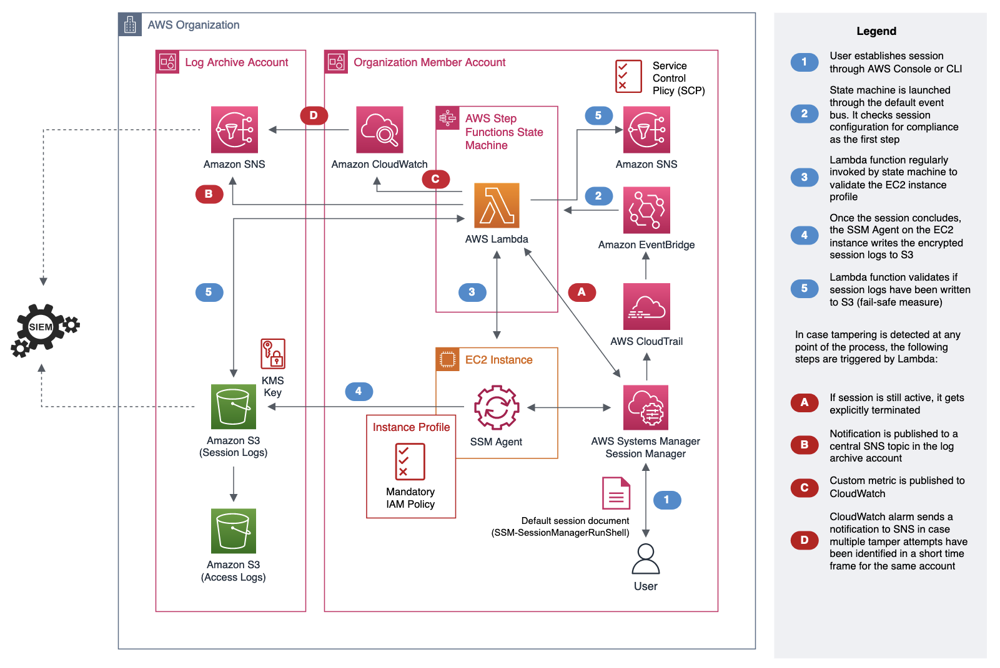

## AWS Systems Manager Session Manager monitoring, logging, guardrails in multi-account setup



## Protecting solution

> This is example SCP that protect resources created by solution, you can after deploying aws-ssm-guardrails-org-member-account.template apply following SCP to that Account.

```Plaintext
{
  "Version": "2012-10-17",
  "Statement": [
    {
      "Sid": "DenyModifyDocument",
      "Effect": "Deny",
      "Action": [
        "ssm:UpdateDocument",
        "ssm:CreateDocument",
        "ssm:DeleteDocument"
      ],
      "Resource": [
        "arn:aws:ssm:*:*:document/SSM-SessionManagerRunShell"
      ]
    },
    {
      "Sid": "ProtectPolicy",
      "Effect": "Deny",
      "Action": [
        "iam:Create*",
        "iam:Delete*"
      ],
      "Resource": [
        "arn:aws:iam::*:policy/aws-ssm-guardrails-mandatory-policy-*"
      ]
    },
    {
      "Sid": "ProtectAlarm",
      "Effect": "Deny",
      "Action": [
        "cloudwatch:PutMetricAlarm",
        "cloudwatch:Disable*",
        "cloudwatch:Delete*"
      ],
      "Resource": [
        "arn:aws:cloudwatch:*:*:alarm:aws-ssm-monitoring-logging-guardrails-multiaccount"
      ]
    },
    {
      "Sid": "ProtectSNSTopicByArn",
      "Effect": "Deny",
      "Action": [
        "sns:AddPermission",
        "sns:RemovePermission",
        "sns:Create*",
        "sns:Delete*"
      ],
      "Resource": [
        "arn:aws:sns:*:*:aws-ssm-monitoring-logging-guardrails-multiaccount"
      ]
    },
    {
      "Sid": "ProtectStateMachineByArn",
      "Effect": "Deny",
      "Action": [
        "states:DeleteStateMachine",
        "states:CreateStateMachine",
        "states:UpdateStateMachine",
        "states:StopExecution"
      ],
      "Resource": [
        "arn:aws:states:*:*:stateMachine:aws-ssm-monitoring-logging-guardrails-multiaccount-statemachine",
        "arn:aws:states:*:*:execution:aws-ssm-monitoring-logging-guardrails-multiaccount-statemachine:*"
      ]
    },
    {
      "Sid": "ProtectOtherSolutionResourcesByArn",
      "Effect": "Deny",
      "Action": [
        "iam:*",
        "lambda:Delete*",
        "lambda:Put*",
        "lambda:Remove*",
        "lambda:Publish*",
        "lambda:Update*",
        "lambda:AddPermission",
        "lambda:RemovePermission",
        "events:*",
        "cloudformation:*"
      ],
      "Resource": [
        "arn:aws:iam::*:role/solution/*",
        "arn:aws:lambda:*:*:function:check-ssm-session-target-iam-role-compliance-function",
        "arn:aws:lambda:*:*:function:check-ssm-session-status-function",
        "arn:aws:lambda:*:*:function:check-ssm-session-s3-log-existence-function",
        "arn:aws:events:*:*:rule/aws-ssm-monitoring-logging-guardrails-multiaccount*",
        "arn:aws:cloudformation:*:*:stack/aws-ssm-guardrails-org-member-account/*"
      ]
    }
  ]
}
```

## Security

See [CONTRIBUTING](CONTRIBUTING.md#security-issue-notifications) for more information.

## License

This library is licensed under the MIT-0 License. See the LICENSE file.

